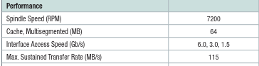
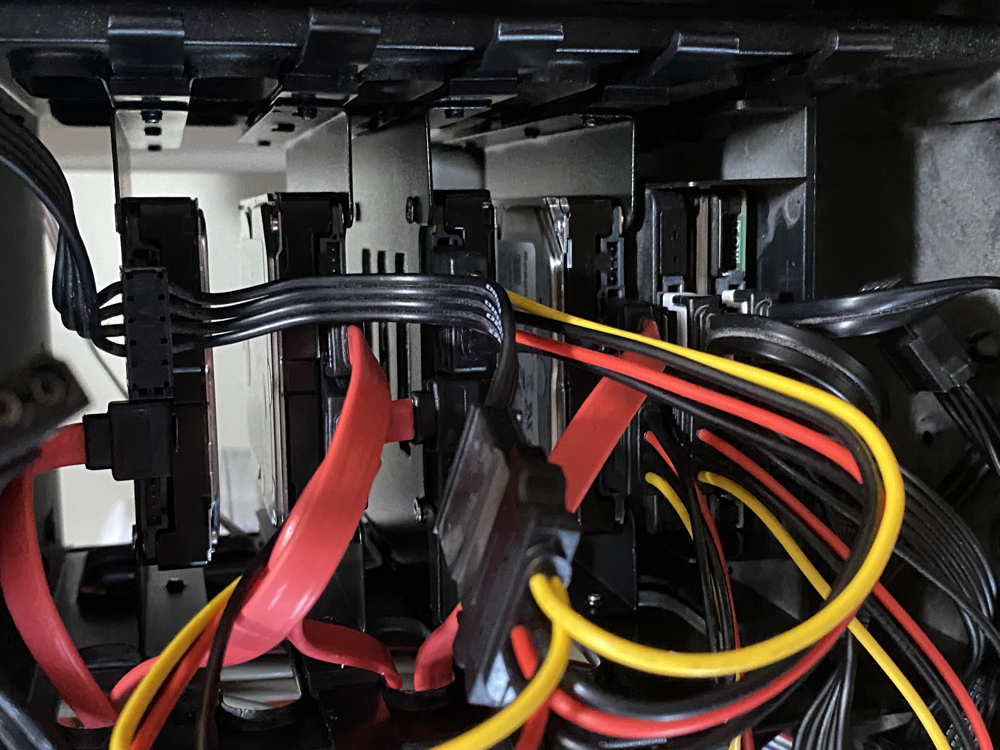
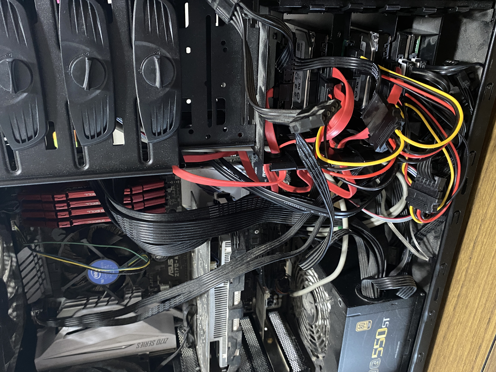
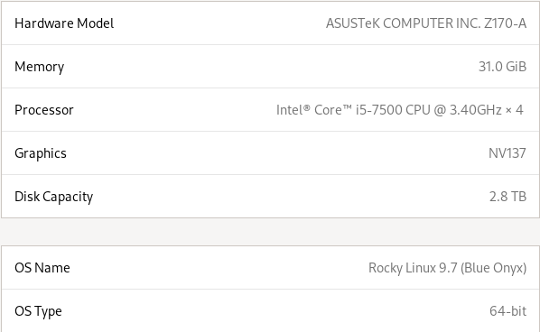

<!-- 
Allows tables and mermaid diagrams to be displayed side by side 
Enclose in <div class="flex-row">, possibly inner divs as well for mermaid
-->
<style>
  .flex-row {
    display: flex;
    gap: 2rem;
  }
</style>

<!-- format style for reports that require it -->
<style>
  body {
    font-family: "Times New Roman", serif;
    font-size: 11pt;
    line-height: 1.0;
    margin: 0.5in;
  }

  img, table, figure {
      page-break-inside: avoid;
  }
</style>

<!-- Allows for latex math to be displayed properly. VSCode and Github shouldn't need it but other tools might -->
<script>
  window.MathJax = {
    tex: {
      inlineMath: [['$', '$'], ['\\(', '\\)']],
      displayMath: [['$$', '$$'], ['\\[', '\\]']]
    }
  };
</script>
<script defer src="https://cdn.jsdelivr.net/npm/mathjax@3/es5/tex-mml-chtml.js"></script>

<!-- Simply inserts a page break, which is mainly only useful for PDF export -->
<!-- <div style="page-break-after: always"></div> -->

# Building a RAID Server
## Author: Joshua Kluthe - S694K397 - Wichita State University
### CS 797K Advanced Topics in Data Storage - Final Research Paper


#### Abstract

*This paper describes an experimental process involving building and configuring a server, and then configuring and benchmarking multiple RAID and ZFS RAIDZ storage arrays on that server. I will compare the actual performance found for the RAID benchmarks against the theoretical values for each RAID array, and determine the causes for any differences found. Finally, I will discuss how this node could be used as a Lustre HPC server, including the configuration, architecture, and shortcomings of such a system.*

#### Server Setup

To begin setting up this server, I was able to use a PC tower that was already on hand. However, to gain consistent results from the RAID arrays, I required 4 identical disks. As an additional challenge, multiple brackets and SATA III cables were needed to install these disks in the PC. I settled on using refurbished Seagate Constellation.2 250GB drives, with the following specifications reported by Seagate [1]:

<figure>
  
  <figcaption>Fig. 1 - Official Seagate Constellation.2 Disk Specs [1]</figcaption>
</figure>

Two additional disks were also installed during this hardware setup, although they were not used and are irrelevant to the experiment, and this process proved challenging for an ATX form factor PC case. The installed system is shown below:

<div class=flex-row>
  <figure>
    
    <figcaption>Fig. 2 - Four RAID disks and two additional disks installed</figcaption>
  </figure>
    <figure>
    
    <figcaption>Fig. 3 - The server node. Proper cable management was deemed unnecessary and impossible</figcaption>
  </figure>
</div>

<div style="page-break-after: always"></div>

For the OS itself, a 1TB NVMe M.2 drive was used, on which was installed Rocky Linux 9.7. The final server specifications, taken directly from the server itself, are shown below:

<figure>
  
  <figcaption>Fig. 4 - Server OS and Hardware Configuration</figcaption>
</figure>

After setting up the server hardware and OS, the next step was to make sure the refurbished disks were functioning properly. For testing and benchmarking purposes, I utilized the industry standard fio utility [2]. After performing several benchmarks, however, it was clear that completing this project would require a benchmarking script. Due to time constraints, I utilized claude.ai to generate a script that allow quick benchmarking and extract the essential information I required [3]. This greatly simplified the benchmarking process. The data gathered included sequential and random RW speeds for both a single job and for 4 concurrent jobs. However, for the purposes of this paper I will focus only on the single job, sequential RW results. The benchmarks for the disks are as follows:

Disk | Sequential Write (MB/s) | Sequential Read (MB/s) |
-----|-------------------------|------------------------|
sdc  | 109                     | 109                    |
sdd  | 113                     | 115                    |
sde  | 112                     | 114                    |
sdf  | 118                     | 118                    |
ave  | 113                     | 114                    |

Fig. 5 - Baseline Disk Benchmarks.

So, we end up with $ X_W = 113 MB/s $ and $ X_R = 114 MB/s $ as our baseline to use for theoretical calculations. This is almost perfectly in line with the specifications from Seagate [1], and shows the disks are healthy and that no single disk should cause bottlenecks in a RAID array. Since this is so close to the Seagate specified $ X = 115MB/x $ figure, I will use that value as X for the rest of this paper.

#### RAID and ZFS Setup and Benchmarking

With the baseline disk RW speeds benchmarked, I then moved on to configuring them into RAID arrays. I considered the commonly used RAID and ZFS RAIDZ levels of:

- RAID 0
- RAID 1
- RAID 5
- RAID 6
- RAIDZ1
- RAIDZ2

All RAID and ZFS arrays include 4 disks, and were measured for sequential R/W running with 1 job, with values in MB/s. They were created using the standard mdadm and zfs linux tools.

There were two significant problems encountered in these benchmarks. First, with RAID 5 and RAID 6, the write speeds were significantly higher than a single disk write speed, and both are supposed to be constrained to the write speed of the slowest disk. After considerable research, I found that this is not always the case. That is the worst case, in which random reads and writes are performed in small segments. In that case, multiple operations must be made in both cases. With 4 disks, RAID 5 must read the data to be overwritten, the parity of the stripe, calculate the new parity, and then write the new data and the new parity. This would result in $ X_W * 0.25 $ write performance, *not* writing at the speed of the slowest disk. RAID 6 must perform a similar set of operations. However, when writing a full stripe of data as was being performed in these benchmarks, RAID 5 only needs to perform a single parity check and then write all the data without the need to read from disk. Maximum performance, then, is actually $ X_W * (N - 1) $. RAID 6 also benefits from this effect, but it has to perform two parity checks before performing the full stripe write, giving it a theoretical $ X_W * (N - 2) $ write speed for the conditions of this experiment. This is explained in further detail in "RAID Performance Considerations" [4].

The second problem encountered came with benchmarking ZFS. In my first benchmarking attempts, both RAIDZ1 and RAIDZ2 showed read speeds of ~15x the theoretical maximum that the four disks combined could provide. The impossibility of these RW speeds led me to conclude that the read was coming from RAM. ZFS, as it turns out, caches aggressively to RAM, as detailed in [5], which makes it difficult to benchmark. The solution to this was removing the cache with the command:

```
sudo zfs set primarycache=none testpool
```

Taking this into consideration, the theoretical and measured results from the experiment are as follows, using N = 4 and X = 115MB/s:

RAID   | Theorerical Write | Measured Write | Theoretical Read | Measured Read |
-------|-------------------|----------------|------------------|---------------|
RAID 0 | N * X = 460       | 431            | N * X = 460      | 439           |
RAID 1 | 1 * X = 115       | 106            | N * X = 460      | 112           |
RAID 5 | (N-1) * X = 345   | 205            | (N-1) * X = 345  | 311           |
RAID 6 | (N-2) * X = 230   | 216            | (N-2) * X = 230  | 263           |
RAIDZ1 | (N-1) * X = 345   | 237            | (N-1) * X = 345  | 341           |
RAIDZ2 | (N-2) * X = 230   | 194            | (N-2) * X = 230  | 170           |

Fig. 6 - Theoretical and Measured Result Comparison

Some of these are very much inline with the theoretical values, others differ greatly. RAID 0 performed almost perfectly according to expectations. RAID 1, however, had a read speed on the order of a single disk. However, examining the benchmark data for read speed with 4 concurrent jobs, the results where 447MB/s, almost matching the theoretical maximum. RAID 5 and 6 both came with in the ballpark of the theorized values, but with some difficult to explain deviations. My research has not found a satisfactory explanation for this behavior. Slower than expected speeds are likely due to parity checking overhead, but faster speeds are more difficult to explain in this case. RAIDZ1 performed quite well on read speed, but clearly software overhead on parity checks made it suffer more than expected on write speed. RAIDZ2, while also clearly suffering from overhead, actually performed quite consistently in this test.

#### Would this Server Pass Muster for a Lustre Cluster?

One of the goals of this project was to experiment with different RAID configurations as possible OSTs for a Lustre installation. Would this server be able to support this? The simple answer is yes. A Lustre server requires A Management Target (MGT), a Metadata Target (MDT), an Object Storage Server (OSS), and one or more Object Storage Targets (OSTs) to function. Preferably, these would be separated on different servers backed up by failover servers, but this is not strictly necessary. In my server example, a single NVMe running Rocky Linux with the Lustre kernel patch would be able to run the MGT, MDT, and OSS daemons necessary to exploit the RAID array as an OST, and serve this to clients. However, it would have multiple shortcomings. First, running Lustre on top of the RAID array would actually slow it down due to the additional CPU overhead. Lustre is intended to coordinate multiple servers to combine them into a high performance computing network, but running on a single node adds additional overhead. Secondly, not only would this setup not have failover servers for MGT, MDT and OSS servers, it would have a single point of failure by running all of these daemons on a single NVMe drive. In short, although this is a useful setup for experimentation and benchmarking, it does not pass muster for a Lustre cluster.

<div style="page-break-after: always"></div>

#### Citations

[1] Seagate Technology, "Seagate Constellation.2 FIPS Product Manual," Seagate Technology LLC, Doc. No. DS1719-4, Jul. 2012. [Online]. <br>
Available: https://www.seagate.com/www-content/product-content/constellation-fam/constellation/constellation-2/en-us/docs/constellation2-fips-ds1719-4-1207us.pdf <br>
[Accessed: Apr. 2026].

[2] J. Axboe, "fio - Flexible I/O Tester,", version 3.x. GitHub. [Online].<br>
Available: https://github.com/axboe/fio<br>
[Accessed: Apr. 2026].

[3] Anthropic, "Claude Sonnet 4.6," claude.ai.<br>
Prompt: "Please generate a bash script that will run fio against disks and RAID targets, and extract RW speeds and IOPS in a simple, readable format and save them to a file" <br>
[Online]. Available: https://claude.ai [Accessed: Apr. 2026].

[4] Mirazon, "RAID Performance Considerations," Mirazon, Jul. 2025. 
[Online].<br>
Available: 
https://www.mirazon.com/raid-performance-considerations/ <br>
[Accessed: Apr. 2026].

[5] Klara Systems, "5 Reasons Why Your ZFS Storage Benchmarks Are Wrong,"
Klara Systems, Oct. 2024. [Online]. <br>
 Available:
https://klarasystems.com/articles/5-reasons-why-your-zfs-storage-benchmarks-are-wrong/ <br>
[Accessed: Apr. 2026].